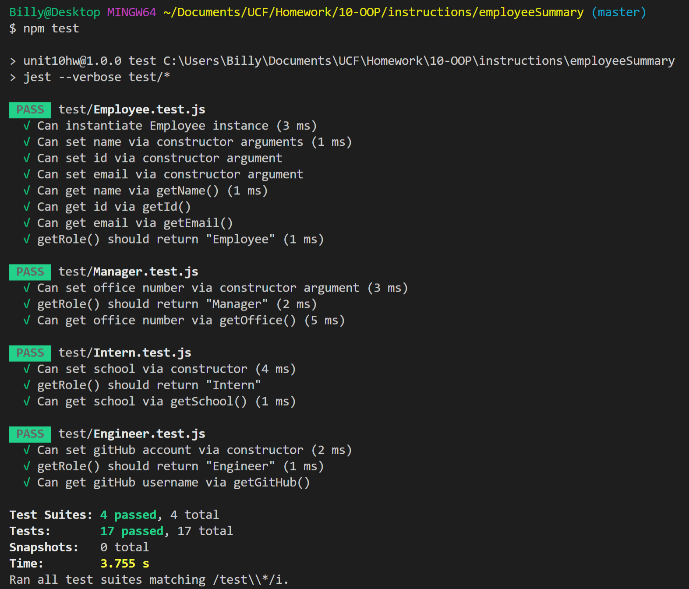
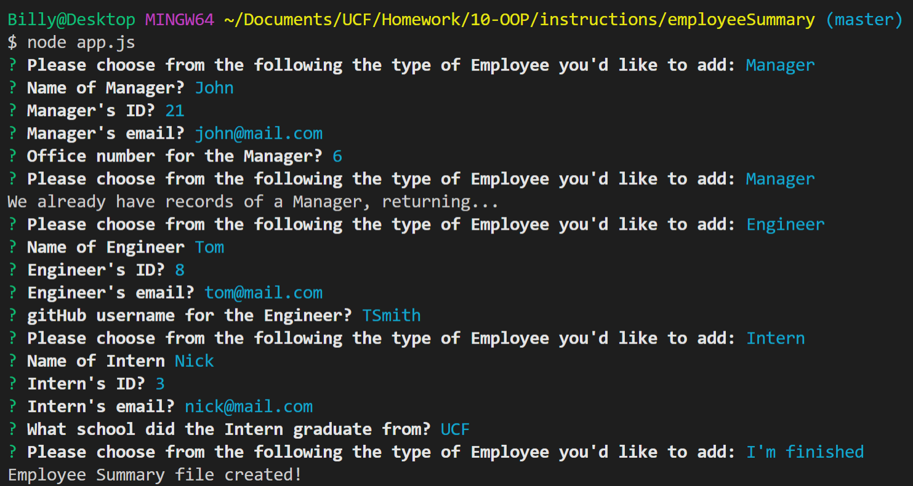
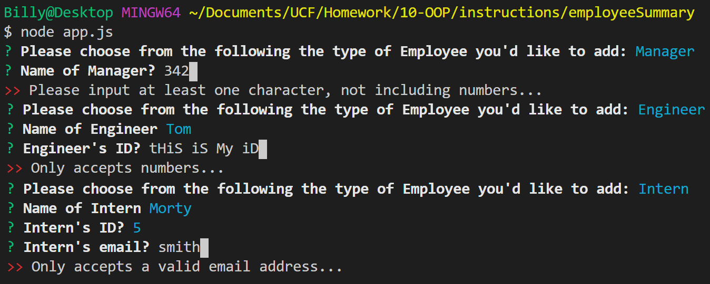
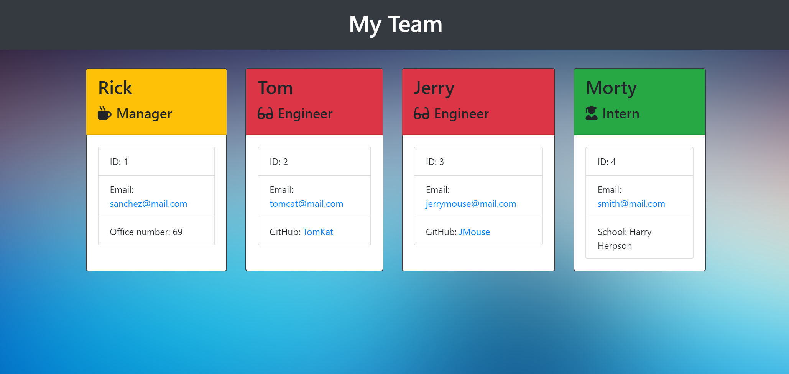

# Employee Summary

  

  In this project, the user will be able to run the Employee Summary application through the node terminal. This application will create an HTML page that will display a small summary of their employees. Once you clone the repository, open your terminal through through the cloned file and check out [installation](#installation). Afterwards, you'll be able to run the command ``` node app.js ```. The user will then be prompted through a list of team members they can add. Once they have added all their team members added, they can execute the "I'm finished" command. This will then generate the user's page. 

  GitHub: https://github.com/WLeondike
  

  ## Table of Contents

  * [Installation](#installation)
  * [Credits](#credits)
  * [License](#license)
  * [Screenshots](#screenshots)
  

  ## Installation
  
  > ``` npm i ``` 
  
  The package.json file will already have the dependencies the user will need.
  
  
  ## Credits
  
  John Dinsmore <br> Jorge Alvarez <br> W3 Schools <br> MDN Web docs <br> gitHub <br> npmjs
  

  ## Screenshots

   <br> <br>
   <br> <br>
   <br> <br>
  


  ## License

  Permission is hereby granted, free of charge, to any person obtaining a copy of this software and associated documentation files (the "Software"), to deal in the Software without restriction, including without limitation the rights to use, copy, modify, merge, publish, distribute, sublicense, and/or sell copies of the Software, and to permit persons to whom the Software is furnished to do so, subject to the following conditions: <br> <br> The above copyright notice and this permission notice shall be included in all copies or substantial portions of the Software. <br> <br> THE SOFTWARE IS PROVIDED "AS IS", WITHOUT WARRANTY OF ANY KIND, EXPRESS OR IMPLIED, INCLUDING BUT NOT LIMITED TO THE WARRANTIES OF MERCHANTABILITY, FITNESS FOR A PARTICULAR PURPOSE AND NONINFRINGEMENT. IN NO EVENT SHALL THE AUTHORS OR COPYRIGHT HOLDERS BE LIABLE FOR ANY CLAIM, DAMAGES OR OTHER LIABILITY, WHETHER IN AN ACTION OF CONTRACT, TORT OR OTHERWISE, ARISING FROM OUT OF OR IN CONNECTION WITH THE SOFTWARE OR THE USE OR OTHER DEALINGS IN THE SOFTWARE.
